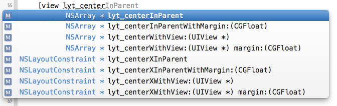

Lyt
===
[](https://travis-ci.org/robotmedia/Lyt)

A UIView category to make autolayout (more) readable and less verbose. 

##Better semantics with less code

Lyt allows you to express the intent of your constraint. Write this:

```objective-c
[view lyt_centerInParent];
```

Instead of:

```objective-c
NSLayoutConstraint *centerXConstraint = [NSLayoutConstraint constraintWithItem:view attribute:NSLayoutAttributeCenterX relatedBy:NSLayoutRelationEqual toItem:view.superview attribute:NSLayoutAttributeCenterX multiplier:1.0 constant:0];
[view.superview addConstraint:centerXConstraint];

NSLayoutConstraint *centerYConstraint = [NSLayoutConstraint constraintWithItem:view attribute:NSLayoutAttributeCenterY relatedBy:NSLayoutRelationEqual toItem:view2 attribute:NSLayoutAttributeCenterY multiplier:1.0 constant:0];
[view.superview addConstraint:centerYConstraint];
```

Or this:

```objective-c
[view lyt_alignSidesToParentWithMargin:10];
```

Instead of:

```objective-c
NSDictionary *views = NSDictionaryOfVariableBindings(view);
NSDictionary *metrics = @{@"margin" : @(10)};
NSArray *constraints = [NSLayoutConstraint constraintsWithVisualFormat:@"H:|-margin-[view]-margin-|" options:kNilOptions metrics:metrics views:views];
[view.superview addConstraints:constraints];
```

##Designed for code completion

Type `lyt_` and then the layout action you want (e.g., `center`) to see what's available.



##License

 Copyright 2013 [Robot Media SL](http://www.robotmedia.net)
 
 Licensed under the Apache License, Version 2.0 (the "License");
 you may not use this file except in compliance with the License.
 You may obtain a copy of the License at
 
 http://www.apache.org/licenses/LICENSE-2.0
 
 Unless required by applicable law or agreed to in writing, software
 distributed under the License is distributed on an "AS IS" BASIS,
 WITHOUT WARRANTIES OR CONDITIONS OF ANY KIND, either express or implied.
 See the License for the specific language governing permissions and
 limitations under the License.
